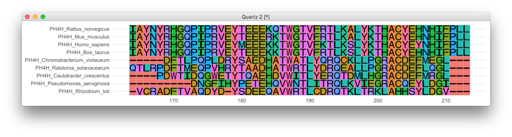

```r
library(ggmsa)
f <- system.file("extdata/sample.fasta", package="ggmsa")
dev.new(width=11, height=2)
ggmsa(f, 164, 213, font = "helvetica_regular", color = "Clustal")
```




### TODO

color schemes

+ <http://www.jalview.org/help/html/colourSchemes/clustal.html>
+ <https://www.dnastar.com/manuals/MegAlignPro/15.2/en/topic/selecting-color-schemes>
+ ...

fonts

+ <https://github.com/yixuan/fontr>

ggtree support

+ re-write `ggtree::msaplot`
