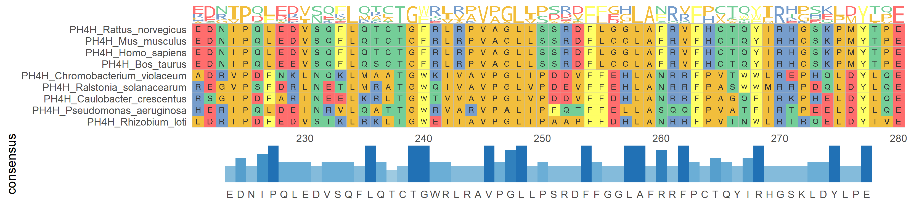

<!-- README.md is generated from README.Rmd. Please edit that file -->

# ggmsa:a visual exploration tool for multiple sequence alignment and associated data 

[](https://github.com/YuLab-SMU/ggmsa)
[](https://lifecycle.r-lib.org/articles/stages.html#experimental)
[](https://cran.r-project.org/web/licenses/Artistic-2.0)
<!-- badges: start -->
<!-- [](https://cran.r-project.org/package=ggmsa)-->
<!-- [](https://cran.r-project.org/package=ggmsa)-->
<!-- badges: end -->

`ggmsa` is designed for visualization and annotation of multiple
sequence alignment. It implements functions to visualize
publication-quality multiple sequence alignments (protein/DNA/RNA) in R
extremely simple and powerful.

For details, please visit <http://yulab-smu.top/ggmsa/>

## :hammer: Installation

The released version from `Bioconductor`

``` r
if (!requireNamespace("BiocManager", quietly=TRUE))
    install.packages("BiocManager")
## BiocManager::install("BiocUpgrade") ## you may need this
BiocManager::install("ggmsa")
```

Alternatively, you can grab the development version from github using
devtools:

``` r
if (!requireNamespace("devtools", quietly=TRUE))
    install.packages("devtools")
devtools::install_github("YuLab-SMU/ggmsa")
```

## :bulb: Quick Example

``` r
library(ggmsa)
protein_sequences <- system.file("extdata", "sample.fasta", package = "ggmsa")
ggmsa(protein_sequences, start = 221, end = 280, char_width = 0.5, seq_name = TRUE) + geom_seqlogo() + geom_msaBar()
```

<!-- -->

## :books: Learn more

Check out the guides for learning everything there is to know about all
the different features:

-   [Getting
    Started](https://yulab-smu.github.io/ggmsa/articles/ggmsa.html)
-   [Annotations](https://yulab-smu.github.io/ggmsa/articles/Annotations.html)
-   [Color Schemes and Font
    Families](https://yulab-smu.github.io/ggmsa/articles/Color_schemes_And_Font_Families.html)
-   [Theme](https://yulab-smu.github.io/ggmsa/articles/guides/MSA_theme.html)
-   [Other
    Modules](https://yulab-smu.github.io/ggmsa/articles/Other_Modules.html)
-   [View
    Modes](https://yulab-smu.github.io/ggmsa/articles/View_modes.html)

## :runner: Author

-   [Guangchuang Yu](https://guangchuangyu.github.io) Professor, PI
-   [Lang Zhou](https://github.com/nyzhoulang) Master’s Student
-   [Shuangbin Xu](https://github.com/xiangpin) PhD Student

**YuLab** <https://yulab-smu.top/>

**Department of Bioinformatics, School of Basic Medical Sciences,
Southern Medical University**

## :sparkling_heart: Contributing

We welcome any contributions! By participating in this project you agree
to abide by the terms outlined in the [Contributor Code of
Conduct](https://github.com/YuLab-SMU/ggmsa/blob/master/CONDUCT.md).
