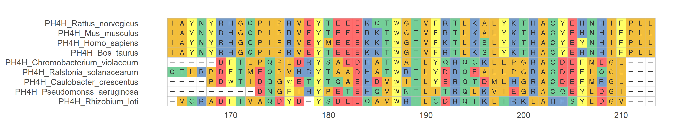

<!-- README.md is generated from README.Rmd. Please edit that file -->

# ggmsa: Plot multiple sequence alignment using ggplot2

<!-- badges: start -->

[](https://cran.r-project.org/package=ggmsa)
[](https://cran.r-project.org/package=ggmsa)
<!-- badges: end -->

`ggmsa` supports visualizing multiple sequence alignment of nucleotide
sequences and protein sequences using ggplot2. It supports a number of
colour schemes, including Chemistry, Clustal, Shapely, Taylor and Zappo.

## Quick Example

Plot multiple sequence alignment(colour scheme = ‘Chemistry’).

### Protein Sequences

``` r
library(ggmsa)
library(ggplot2)
protein_sequences <- system.file("extdata", "sample.fasta", package = "ggmsa")
ggmsa(protein_sequences, 164, 213, color = "Chemistry_AA")
```

<!-- -->

### DNA Sequences

``` r
nt_sequences <- system.file("extdata", "LeaderRepeat_All.fa", package = "ggmsa")
ggmsa(nt_sequences,font = NULL, color = "Chemistry_NT")
```

<!-- -->

### RNA Sequences

``` r
miRNA_sequences <- system.file("extdata", "seedSample.fa", package = "ggmsa")
ggmsa(miRNA_sequences, color = "Chemistry_NT")
```

<!-- -->

## Visualizing Multiple Sequence Alignment With `ggtree`.

``` r
library(Biostrings)
x <- readAAStringSet(protein_sequences)
d <- as.dist(stringDist(x, method = "hamming")/width(x)[1])
library(ape)
tree <- bionj(d)
library(ggtree)
p <- ggtree(tree ) + geom_tiplab()

data = tidy_msa(x, 164, 213)
p + geom_facet(geom = geom_msa, data = data,  panel = 'msa',
               font = NULL, color = "Chemistry_AA") +
    xlim_tree(1)
```

<!-- -->

# Learn more

For more details, please refer to the [online
vignette](https://cran.r-project.org/web/packages/ggmsa/vignettes/ggmsa.html)

If you have installed it, you can also view the vignette on local.

``` r
browseVignettes("ggmsa")
```
