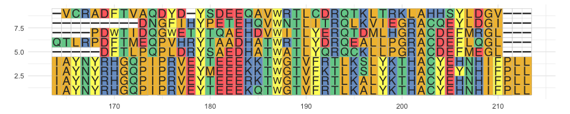
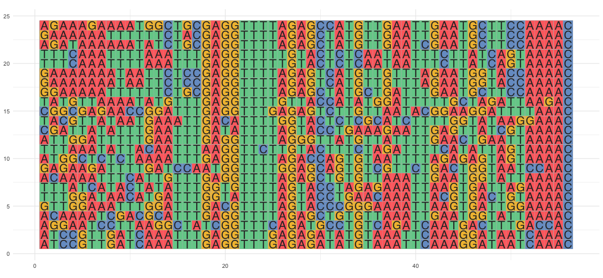
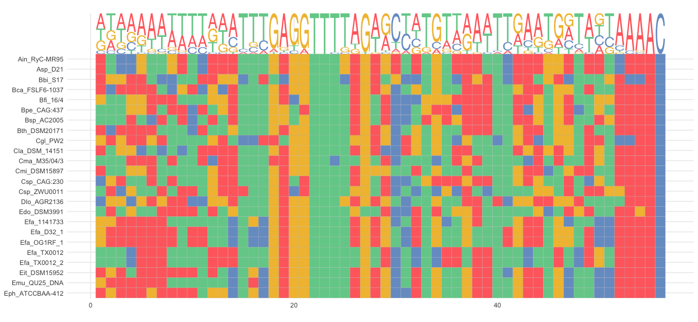
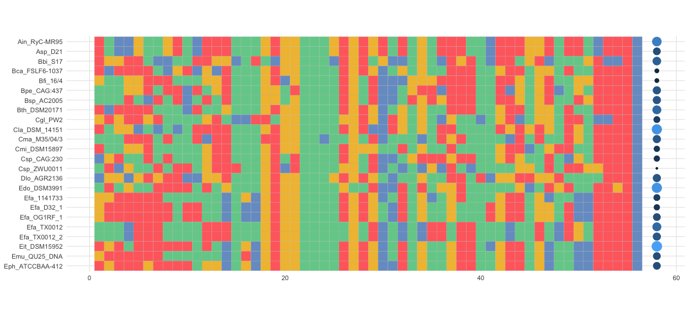
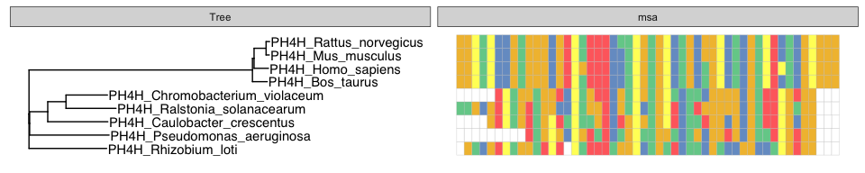

---
output:
  html_document:
    keep_md: yes
    self_contained: no
---

#  ggmsa: Plot multiple sequence alignment using ggplot2

**ggmsa** supports visualizing multiple sequence alignment of DNA and protein sequences using ggplot2. It supports a number of colour schemes, including Chemistry, Clustal, Shapely, Taylor and Zappo.

##  Quick Example 
Plot multiple sequence alignment(colour scheme = 'Chemistry').

###  protein sequences

```r
library(ggmsa)
library(ggplot2)
protein_sequences <- system.file("extdata", "sample.fasta", package = "ggmsa")
ggmsa(protein_sequences, 164, 213, color = "Chemistry_AA")
```

<!-- -->

###  DNA sequences

```r
nt_sequence <- system.file("extdata", "LeaderRepeat_All.fa", package = "ggmsa")
ggmsa(nt_sequence, color = "Chemistry_NT")
```

<!-- -->

##  Visualizing multiple sequence alignment with sequence logo.

```r
f <- system.file("extdata", "LeaderRepeat_All.fa", package = "ggmsa")
ggmsa(f, font = NULL, color = "Chemistry_NT" ) + geom_seqlogo(f)
```

<!-- -->

##  Visualizing multiple sequence alignment with GC content.

```r
f <- system.file("extdata", "LeaderRepeat_All.fa", package = "ggmsa")
ggmsa(f, font = NULL, color = "Chemistry_NT" ) + geom_GC(f)
```

<!-- -->

##  Visualizing multiple sequence alignment with ggtree.

```r
library(Biostrings)
x <- readAAStringSet(protein_sequences)
d <- as.dist(stringDist(x, method = "hamming")/width(x)[1])
library(ape)
tree <- bionj(d)
library(ggtree)
p <- ggtree(tree ) + geom_tiplab()

data = tidy_msa(x, 164, 213)
p + geom_facet(geom = geom_msa, data = data,  panel = 'msa',
               font = NULL, color = "Chemistry_AA") +
    xlim_tree(1)
```

<!-- -->
