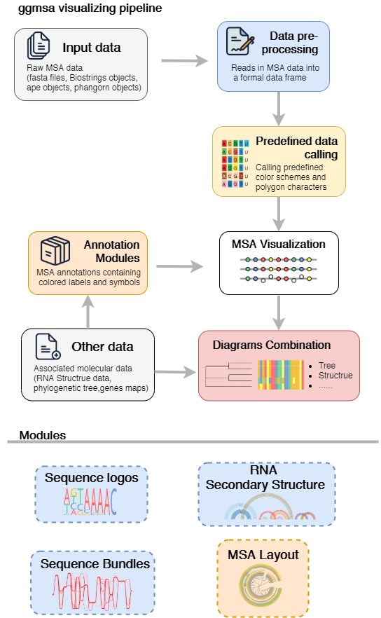

```{r, include = FALSE}
knitr::opts_chunk$set(
  collapse = TRUE,
  comment = "#>"
)

CRANpkg <- function(pkg) {
    cran <- "https://cran.r-project.org/package"
    fmt <- "[%s](%s=%s)"
    sprintf(fmt, pkg, cran, pkg)
}

Biocpkg <- function(pkg) {
    sprintf("[%s](http://bioconductor.org/packages/%s)", pkg, pkg)
}

library(ggmsa)
library(ggplot2)
```


#  Introduction

ggmsa is a package designed to plot multiple sequence alignments using `r CRANpkg("ggplot2")` .

This package implements functions to visualize publication-quality multiple sequence alignments (protein/DNA/RNA) in R extremely simple and powerful. It uses module design to annotate sequence alignments and allows to accept other datasets for diagrams combination.`r CRANpkg("ggmsa")`, (current version: `r packageVersion('ggmsa')`) is avalable via CRAN. 

In this tutorial, we’ll work through the basics of using ggmsa.

```{r}
library("ggmsa")
```


```{r echo=FALSE, out.width='50%'}

```


#  Importing MSA data

We’ll start by importing some example data to use throughout this tutorial. Expect FASTA files, some of the objects in R can also as input. `available_msa()` can be used to list MSA objects currently available.

```{r warning=FALSE}
 available_msa()

 protein_sequences <- system.file("extdata", "sample.fasta", package = "ggmsa")
 miRNA_sequences <- system.file("extdata", "seedSample.fa", package = "ggmsa")
 nt_sequences <- system.file("extdata", "LeaderRepeat_All.fa", package = "ggmsa")
 
```

# Basic use: MSA Visualization

The most simple code to use ggmsa:
```{r fig.height = 2, fig.width = 10, warning=FALSE}
ggmsa(protein_sequences, 300, 350, color = "Clustal", font = "DroidSansMono", char_width = 0.5, seq_name = T )
```

##  Color Schemes

ggmsa predefines several color schemes for rendering MSA are shipped in the package. In the same ways, using `available_msa()` to list  color schemes currently available. Note that amino acids (protein) and nucleotides (DNA/RNA) have different names.

```{r warning=FALSE}
available_colors()
```

```{r echo=FALSE, out.width = '50%'}
knitr::include_graphics("man/figures/schemes.png")
```

##  Font

Several predefined fonts are shipped ggmsa. Users can use `available_fonts()` to list the font currently available.

```{r warning=FALSE}
available_fonts()
```

#  MSA Annotation

ggmsa supports annotations for MSA. Similar to the ggplot2, it implements annotations by `geom` and users can perform annotation with `+` , like this: `ggmsa() + geom_*()`. Automatically generated annotations that containing colored labels and symbols are overlaid on MSAs to indicate potentially conserved or divergent regions.

For example, visualizing multiple sequence alignment with **sequence logo** and **bar chart**:

```{r fig.height = 2.5, fig.width = 11, warning = FALSE, message = FALSE}
ggmsa(protein_sequences, 221, 280, seq_name = TRUE, char_width = 0.5) + geom_seqlogo(color = "Chemistry_AA") + geom_msaBar()
```


This table shows the annnotation layers supported by ggmsa as following:

```{r  echo=FALSE, results='asis', warning=FALSE, message=FALSE}  

x <- "geom_seqlogo()\tgeometric layer\tautomatically generated sequence logos for a MSA\n
geom_GC()\tannotation module\tshows GC content with bubble chart\n
geom_seed()\tannotation module\thighlights seed region on miRNA sequences\n
geom_msaBar()\tannotation module\tshows sequences conservation by a bar chart\n
geom_helix()\tannotation module\tdepicts RNA secondary structure as arc diagrams(need extra data)\n
 "
require(dplyr)
xx <- strsplit(x, "\n\n")[[1]]
y <- strsplit(xx, "\t") %>% do.call("rbind", .)
y <- as.data.frame(y, stringsAsFactors = F)

colnames(y) <- c("Annotation modules", "Type", "Description")

require(kableExtra)

knitr::kable(y, align = "l", booktabs = T, escape = T) %>% 
    kable_styling(latex_options = c("striped", "hold_position", "scale_down"))
  
```

# Combination Plot

Other molecular datasets can be accepted and rendered by ggmsa (i.e. gene structure diagram, phylogenetic tree diagram, gene arrow maps). ggmsa allows users to align such associated graphs in MSA plot.

## MSA + Tree

The most important part of phylogenetic analysis is the visual inspection, annotation and exploration of phylogenetic trees. This is no surprise that aligning phylogenetic tree to the MSA plot. ggtree has called to plot phylogenetic trees.

```{r fig.height=2, fig.width=10, message=FALSE, warning=FALSE}
library(Biostrings)
x <- readAAStringSet(protein_sequences)
d <- as.dist(stringDist(x, method = "hamming")/width(x)[1])
library(ape)
tree <- bionj(d)
library(ggtree)
p <- ggtree(tree) + geom_tiplab()

data = tidy_msa(x, 164, 213)
p + geom_facet(geom = geom_msa, data = data,  panel = 'msa',
               font = NULL, color = "Chemistry_AA") +
    xlim_tree(1)
```

## Multiple graphs: MSA + Tree + gene map

A notable example is integrated three associated panels. MSA plot, phylogenetic tree and gene map produced by ggmsa, ggtree and gggenes respectively.
```{r fig.height=4, fig.width=14, message=FALSE, warning=FALSE}
#import data
tp53_sequences <-  system.file("extdata", "tp53.fa", package = "ggmsa")
tp53_genes <- system.file("extdata", "TP53_genes.xlsx", package = "ggmsa")

#tree
tp53 <- readAAStringSet(tp53_sequences)
d <- as.dist(stringDist(tp53, method = "hamming")/width(tp53)[1])
tree <- bionj(d)
p_tp53 <- ggtree(tree, branch.length = 'none') + geom_tiplab()
#msa
data_53 <- tidy_msa(tp53)

#gene maps
TP53_arrow <- readxl::read_xlsx(tp53_genes)
TP53_arrow$direction <- 1
TP53_arrow[TP53_arrow$strand == "reverse","direction"] <- -1

#color
library(RColorBrewer)
mapping = aes(xmin = start, xmax = end, fill = gene, forward = direction)
my_pal <- colorRampPalette(rev(brewer.pal(n = 10, name = "Set3")))

#tree + gene maps + msa
library(ggnewscale)
p_tp53 + geom_facet(geom = geom_msa, data = data_53,
                     panel = 'msa', font = NULL,
                     border = NA) + xlim_tree(3.5) + 
          new_scale_fill() +
          scale_fill_manual(values = my_pal(10)) +
          geom_facet(geom = geom_motif,
                     mapping = mapping, data = TP53_arrow,
                     panel = 'genes',  on = 'TP53',
                     arrowhead_height = unit(3, "mm"),
                     arrowhead_width = unit(1, "mm"))
```

#  Layout

Different layouts allow users to display more data in a given limited space. We offer two layouts to change MSA visualization styles.

##  Broken down layout

The long sequence has be broken down and displayed in several lines by `facet_msa()`.

```{r fig.height = 5, fig.width = 10, message=FALSE, warning=FALSE}
 # 4 fields
 ggmsa(protein_sequences, start = 0, end = 400, font = NULL, color = "Chemistry_AA") + facet_msa(field = 100)
```

## Circular layout

A specific layout of the alignment can also be displayed by linking ggtreeExtra. `geom_fruit` will automatically align MSA graphs to the tree with a couple of layouts such as circular, fan andand radial.

```{r fig.height=5, fig.width =5, message = FALSE, warning= FALSE}
library(ggtree)
library(ggtreeExtra)
sequences <- system.file("extdata", "sequence-link-tree.fasta", package = "ggmsa")

x <- readAAStringSet(sequences)
d <- as.dist(stringDist(x, method = "hamming")/width(x)[1])
tree <- bionj(d)
data <- tidy_msa(x, 120, 200)

p1 <- ggtree(tree, layout = 'circular') + 
    geom_tiplab(align = TRUE, offset = 0.545, size = 2) + 
        xlim(NA, 1.3)
p1 + geom_fruit(data = data, geom = geom_msa, offset = 0, 
                pwidth = 1.2, font = NULL, border = NA)
```

