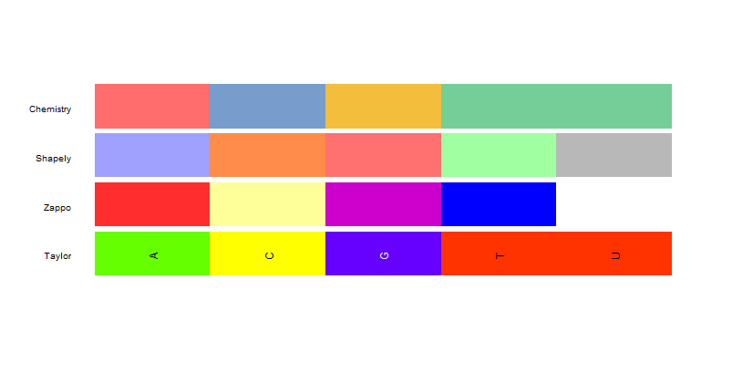
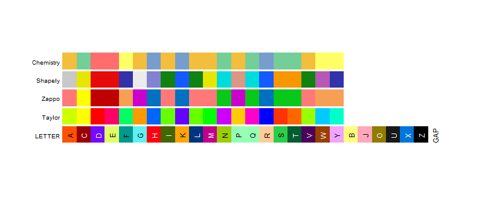

```{r, include = FALSE}
knitr::opts_chunk$set(
  collapse = TRUE,
  comment = "#>"
)

CRANpkg <- function(pkg) {
    cran <- "https://cran.r-project.org/package"
    fmt <- "[%s](%s=%s)"
    sprintf(fmt, pkg, cran, pkg)
}

Biocpkg <- function(pkg) {
    sprintf("[%s](http://bioconductor.org/packages/%s)", pkg, pkg)
}

library(ggmsa)
library(ggplot2)
```


#  Introduction

Plot multiple sequence alignment using `r CRANpkg("ggplot2")` with multiple color schemes supported.

Supports visualizing multiple sequence alignment of DNA and protein sequences using ggplot2 It supports a number of colour schemes, including Chemistry, Clustal, Shapely, Taylor and Zappo. Multiple sequence alignment can easily be combined with other 'ggplot2' plots, such as aligning a phylogenetic tree produced by 'ggtree' with multiple sequence alignment.

#  Installation

This R package (`r CRANpkg("ggmsa")`, current version: `r packageVersion('ggmsa')`) is avalable via CRAN. The way to install the package is the following:

```{r eval=FALSE}
## installing the package
install.packages("ggmsa")
## loading the package
library("ggmsa")
```

The development version from github:
```{r eval=FALSE}
if (!requireNamespace("devtools", quietly=TRUE))
    install.packages("devtools")
devtools::install_github("YuLab-SMU/ggmsa")
```

## Load sample data

Three sample data are shipped with the ggmsa package. Note that ggmsa supports not only fasta files but other objects as well. `available_msa()`can be used to list MSA objects currently available.

```{r warning=FALSE}
 available_msa()

 protein_sequences <- system.file("extdata", "sample.fasta", package = "ggmsa")
 miRNA_sequences <- system.file("extdata", "seedSample.fa", package = "ggmsa")
 nt_sequences <- system.file("extdata", "LeaderRepeat_All.fa", package = "ggmsa")
 
```

# Visualizing Multiple Sequence Alignments

The most simple code to use ggmsa:
```{r fig.height = 2, fig.width = 10, warning=FALSE}
ggmsa(protein_sequences, start = 265, end = 300)
```

##  Colour Schemes
Several classic color schemes for MSA are shipped in the package. In the same ways, you can use `available_msa()` to list  colour schemes currently available. Note that Amino acids and nucleotides have different colour schemes.
```{r warning=FALSE}
 available_colors()
```

```{r echo=FALSE, out.width = '70%'}

```

```{r echo=FALSE, out.width = '90%'}

```


### Clustal X Colour Scheme

This is an emulation of the default colourscheme used for alignments in [Clustal X](http://www.jalview.org/help/html/colourSchemes/clustal.html), a graphical interface for the ClustalW multiple sequence alignment program. Each residue in the alignment is assigned a colour if the amino acid profile of the alignment at that position meets some minimum criteria specific for the residue type.

```{r fig.height = 3, fig.width = 10, warning=FALSE}
ggmsa(protein_sequences, start = 320, end = 360, color = "Clustal")
```

### Color by Chemistry(Default)

Amino acids are colored according to their side chain chemistry:

```{r fig.height = 3, fig.width = 10, warning=FALSE}
ggmsa(protein_sequences, start = 320, end = 360, color = "Chemistry_AA")
```

### Color by Shapely

This color scheme matches the RasMol amino acid and RasMol nucleotide [color schemes](http://openrasmol.org/doc/rasmol.html#shapelycolours), which are, in turn, based on Robert Fletterick’s "Shapely models".

```{r fig.height = 3, fig.width = 10, warning=FALSE}
ggmsa(protein_sequences, start = 320, end = 360, color = "Shapely_AA")
```

### Color by Taylor

This color scheme is taken from Taylor[@Taylor1997Residual] and is also used in JalView[@Waterhouse2009Jalview].

```{r fig.height = 3, fig.width = 10, warning=FALSE}
ggmsa(protein_sequences, start = 320, end = 360, color = "Taylor_AA")
```

### Color by Zappo

This scheme colors residues according to their physico-chemical properties, and is also used in JalView[@Waterhouse2009Jalview].

```{r fig.height = 3, fig.width = 10, warning=FALSE}
ggmsa(protein_sequences, start = 320, end = 360, color = "Zappo_AA")
```

### Color by LETTER

Thanks to [ShixiangWang](https://github.com/YuLab-SMU/ggmsa/pull/9/commits/c736dbbf3ecd64a8ce921b9474a699fcd44ec7b3) for the color scheme suggestions.

[https://en.wikipedia.org/wiki/Help:Distinguishable_colors](https://en.wikipedia.org/wiki/Help:Distinguishable_colors) 

```{r fig.height = 3, fig.width = 10, warning=FALSE}
ggmsa(protein_sequences, start = 320, end = 360, color = "LETTER")
```

## Font

Several classic font for MSA are shipped in the package. In the same ways, you can use `available_fonts()` to list  font currently available

```{r warning=FALSE}
 available_fonts()
```

```{r fig.height = 3, fig.width = 10, warning=FALSE}
ggmsa(protein_sequences, start = 320, end = 360, font = "helvetical", color = "Chemistry_AA")
```
```{r fig.height = 3, fig.width = 10, warning=FALSE}
ggmsa(protein_sequences, start = 320, end = 360, font = "TimesNewRoman", color = "Chemistry_AA")
```
```{r fig.height = 3, fig.width = 10, warning=FALSE}
ggmsa(protein_sequences, start = 320, end = 360, font = "DroidSansMono", color = "Chemistry_AA")
```

If you specify `font = NULL`, only tiles will be plot.
```{r fig.height = 3, fig.width = 10, warning=FALSE}
ggmsa(protein_sequences, start = 320, end = 360, font = NULL, color = "Chemistry_AA")
```


## Other params

**Characters width** can be specified by `char_width`. Defaults is 0.9.
```{r fig.height = 3, fig.width = 10, warning=FALSE}
ggmsa(protein_sequences, start = 320, end = 360, char_width = 0.5, color = "Chemistry_AA")
```


**Background** can be specified by `none_bg`. If `none_bg = TRUE`, only the character will be plot.
```{r fig.height = 3, fig.width = 10, warning=FALSE}
ggmsa(protein_sequences, start = 320, end = 360, none_bg = TRUE) + theme_void()
```

**Position Highligthed** can be specified by `posHighligthed`. The `none_bg = FALSE` when you specified position Highligthed by  `posHighligthed`
```{r fig.height = 3, fig.width = 10, warning=FALSE}
ggmsa(protein_sequences, 164, 213, color = "Chemistry_AA", 
      posHighligthed = c(185, 190))
```

**Sequence names**  Defaults is 'NULL' which indicates that the sequence name is displayed when `font = NULL`, but 'font = char' will not be displayed.


If `seq_name = TRUE` the sequence name will be displayed when you need it. 
```{r fig.height = 3, fig.width = 10, warning=FALSE}
ggmsa(protein_sequences, 164, 213, color = "Chemistry_AA", seq_name = TRUE)
```


If `seq_name = FALSE` the sequence name will not be displayed in any case.
```{r fig.height = 3, fig.width = 10, warning=FALSE}
ggmsa(protein_sequences, 164, 213, font = NULL, color = "Chemistry_AA", seq_name = FALSE)
```

#  Reference
